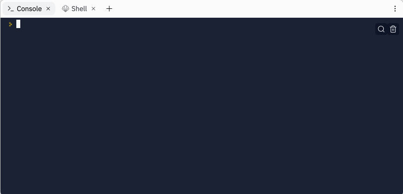

# Day 1 - Working with Variables in Python to Manage Data

## Exercise

- https://replit.com/@NaeimehNajafiza/day-1-printing-start#main.py
- https://replit.com/@NaeimehNajafiza/day-1-2-exercise#main.py
- https://replit.com/@NaeimehNajafiza/day-1-3-exercise#main.py
- https://replit.com/@NaeimehNajafiza/day-1-variables-start#main.py

## Band Name Generator

https://replit.com/@NaeimehNajafiza/band-name-generator-start#main.py
