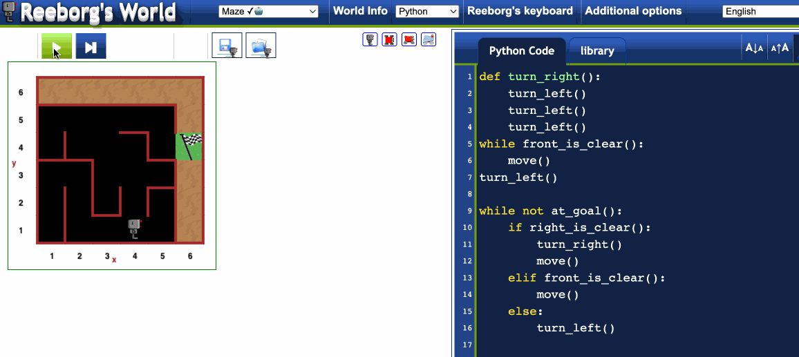

# Day 6 - Python Functions and Karel the robot
I was supposed to write the code that's required to instruct a little robot(Karel) to be able to complete any randomly generated maze. 
The platform was reeborg.ca

## Exercise
We exercised a couple of reeborg.ca maze scenarios. Please see the cool gif below for the final maze version.

## Escaping the Maze

https://reeborg.ca/reeborg.html?lang=en&mode=python&menu=worlds%2Fmenus%2Freeborg_intro_en.json&name=Maze&url=worlds%2Ftutorial_en%2Fmaze1.json
