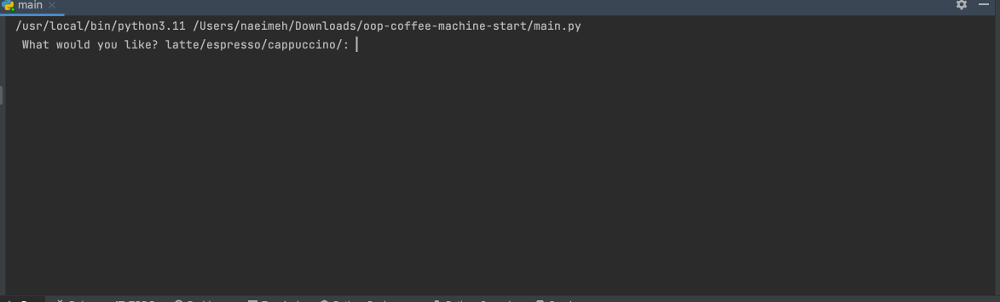

# Day 16 - Intermediate - Object Oriented Programming (OOP)

My coding is different from what Dr. Angela explains. Check it out! 
# OOP Coffee Machine

This project demonstrates the use of object-oriented programming (OOP) concepts in the design and implementation of a coffee machine.

The project consists of the following classes:

## MenuItem

Models each menu item. It has the following attributes:

- `name`: the name of the menu item.
- `cost`: the cost of the menu item.
- `ingredients`: a dictionary containing the ingredients required to make the menu item.

## Menu

Models the menu with drinks. It has the following attributes:

- `menu`: a list of `MenuItem` objects.

The `Menu` class has the following methods:

- `get_items`: returns a string containing the names of all available menu items, separated by a forward slash.
- `find_drink`: searches the menu for a particular drink by name. If the drink is found, it returns that item. Otherwise, it returns `None`.

## MoneyMachine

Models the machine that handles payment. It has the following attributes:

- `profit`: the total profit made by the machine.
- `money_received`: the total amount of money received from the user.

The `MoneyMachine` class has the following methods:

- `report`: prints the current profit.
- `process_coins`: prompts the user to insert coins and calculates the total amount of money received.
- `make_payment`: checks if the payment is sufficient to cover the cost of the order. If it is, it returns `True`. Otherwise, it returns `False`.

## CoffeeMaker

Models the machine that makes the coffee. It has the following attributes:

- `resources`: a dictionary containing the resources (water, milk, and coffee) available in the machine.

The `CoffeeMaker` class has the following methods:

- `report`: prints a report of all resources.
- `is_resource_sufficient`: takes a `MenuItem` object as an argument and returns `True` if the machine has enough resources to make the drink, or `False` if it does not.
- `make_coffee`: takes a `MenuItem` object as an argument and deducts the required ingredients from the resources.

CoffeeMaker: models the machine that makes the coffee. It has the following attributes:

resources: a dictionary containing the resources (water, milk, and coffee) available in the machine.
The CoffeeMaker class has the following methods:

report: prints a report of all resources.
is_resource_sufficient: takes a MenuItem object as an argument and returns True if the machine has enough resources to make the drink, or False if it does not.
make_coffee: takes a MenuItem object as an argument and deducts the required ingredients from the resources.
To use the coffee machine, the user is prompted to enter their choice from the menu. If the user selects "off", the machine is turned off. If the user selects "report", the machine prints a report of the resources and profit.

In the main script, we first create instances of the `CoffeeMaker`, `Menu`, and `MoneyMachine` classes.

We then enter a loop that prompts the user for input. The user can choose to turn off the machine, print a report of the resources and profit, or order a drink.

If the user chooses to order a drink, we search the menu for the specified drink using the `find_drink` method. If the drink is found, we check if there are enough resources to make the drink using the `is_resource_sufficient` method. If there are enough resources, we prompt the user to insert coins and process the payment using the `process_coins` and `make_payment` methods. If the payment is successful, we update the resources and make the coffee using the `make_coffee` method.

This demonstrates how the different classes and their methods interact with each other to create a functioning coffee machine program.

